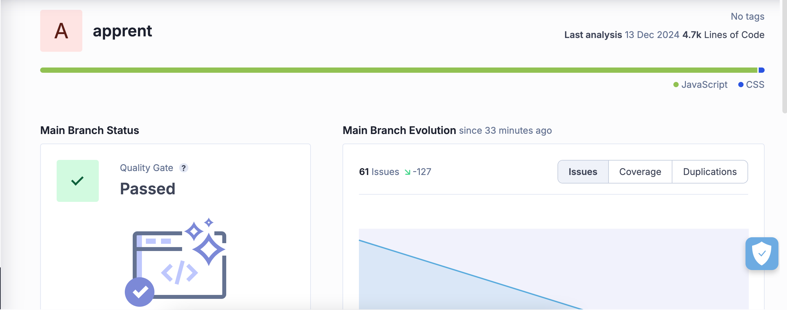

# 🏘️ Properties with Views Platform

## 🌐 Overview

This is a web application built with Next.js, Firebase Authentication, and Firestore. The platform supports three user roles (User, Manager, and Admin) with comprehensive property management capabilities.

## ✨ Features

### 👥 User Roles

- 👤 **User**: Default role upon signup
- 🏡 **Manager**: Automatically assigned when first property is added
- 🛡️ **Admin**: Full platform management capabilities

### 🔑 Key Functionalities

- 📋 Property listing and management
- 🔐 Role-based access control
- 📆 iCal integration
- 🔍 Property filtering
- 🗺️ Interactive map view (Mapbox)
- 📊 Analytics dashboards

## 🛠️ Prerequisites

- 💻 Node.js (v18 or later)
- 📦 npm (v9 or later)
- 🔥 Firebase Account

## 🚀 Installation

1. Clone the repository

```bash
git clone https://github.com/gogamar/apprent.git
cd apprent
```

2. Install dependencies

```bash
npm install
```

3. Set up Configuration

- 🌐 Create a Firebase project at [Firebase Console](https://console.firebase.google.com/)
- 🔑 Generate web app and service account configurations
- 📄 Create a `.env.local` file in the project root with the following variables:

```
NEXT_PUBLIC_FIREBASE_API_KEY=your_firebase_api_key
NEXT_PUBLIC_FIREBASE_AUTH_DOMAIN=your_firebase_auth_domain
NEXT_PUBLIC_FIREBASE_PROJECT_ID=your_firebase_project_id
NEXT_PUBLIC_FIREBASE_STORAGE_BUCKET=your_firebase_storage_bucket
NEXT_PUBLIC_FIREBASE_MESSAGING_SENDER_ID=your_firebase_messaging_sender_id
NEXT_PUBLIC_FIREBASE_APP_ID=your_firebase_app_id

NEXT_PUBLIC_CLOUDINARY_URL=your_cloudinary_url
NEXT_PUBLIC_MAPBOX_TOKEN=your_mapbox_token
NEXT_PUBLIC_AFFILIATE_ID=your_affiliate_id

FIREBASE_CLIENT_EMAIL=your_firebase_client_email
FIREBASE_PRIVATE_KEY=your_firebase_private_key
```

## 🖥️ Running the Application

### 🛠️ Development Mode

```bash
npm run dev
```

The application will be available at `http://localhost:3000`

### 🌐 Production Build

```bash
npm run build
npm start
```

## 👥 User Roles and Permissions

### 👤 User

- 🔍 Can browse properties
- 🔐 Can signup/login
- 🆕 Default initial role

### 🏡 Manager

- 🆙 Auto-promoted when first property is added
- Can:
  - 👀 View own properties
  - ✏️ Edit own properties
  - 📆 Add iCal links
  - 📅 Add personal events
  - 🌐 Publish/unpublish own properties

### 🛡️ Admin

- Can do everything a Manager can, plus:
  - 🕸️ Webscrape properties from Booking.com
  - ⭐ Set properties as featured
  - 📊 View analytics dashboards
  - 🌍 Manage all properties system-wide

## 🏠 Homepage Filtering Options

- 🌅 View Types: Sea View, Landmark View
- ✨ Features: Custom property features
- 📍 Location: Geographical filtering

## 🗺️ Map Features

- 🏘️ Property Display with Mapbox
- 🌍 Country-based Filtering

## 💻 Technology Stack

- 🖥️ Frontend: Next.js
- 🔐 Authentication: Firebase Authentication
- 💾 Database: Firestore
- 🎨 Styling: Tailwind CSS
- 🗺️ Maps: Mapbox
- 🖼️ Image Management: Cloudinary
- 📅 Calendar: FullCalendar
- 📊 Charting: Chartjs

## 🔒 Environment Variables

Ensure all configuration variables are set in `.env.local`, including:

- Firebase credentials
- Mapbox access token
- Cloudinary URL

## 🔒 SonarCloud

SonarCloud is an automated code review tool that continuously inspects code quality, helping detect bugs, vulnerabilities, and code smells. The visualization below provides insights into our project's code quality metrics, including security, reliability, and maintainability.



Key aspects analyzed:

- Code coverage
- Security vulnerabilities
- Code duplications
- Maintainability rating
